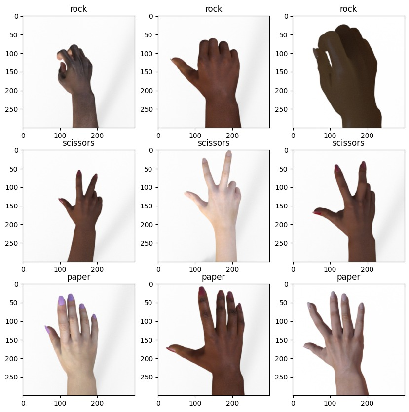

<!-- PROJECT LOGO -->
 

    

<h1 align="center">Rock, Paper, Scissors Prediction</h1>
  

    This project focuses on creating a deep learning model to predict
    images of rock, paper, scissors.
  

### Authors
- Irham Bagus J 

## Dataset
Dataset yang dipakai adalah dari modul sebelumnya. [Berikut link dataset.]((https://drive.google.com/drive/folders/1-5efasTceqGvxi10wCaU3FzjeEnybOyw?usp=sharing))

    

### Data Preprocessing
Dataset pertama-tama dipecah menggunakan perpustakaan *splitfolders* menjadi 3 set: pelatihan, validasi, dan pengujian dengan proporsi masing-masing 80, 10, dan 10 persen.

## Deep Learning Model
Deep learning bertujuan untuk membuat mesin atau program komputer dapat belajar secara otomatis dan mampu membuat keputusan atau tugas tanpa perlu pemrograman eksplisit untuk setiap langkahnya.

### Model Training
Model
|   Training and Validation accuracy | Training and Validation loss |
| ------------- | ------------- |

### Model Evaluation
Setelah model dilatih, dataset pengujian digunakan untuk mengevaluasi model.

Berdasarkan laporan klasifikasi, model ini memprediksi label untuk setiap gambar pada kumpulan data pengujian dengan sangat baik
